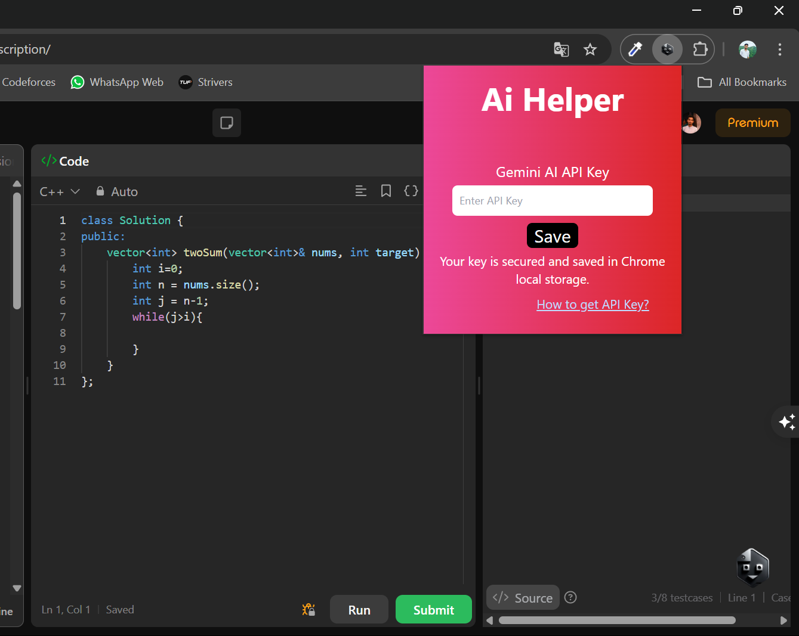
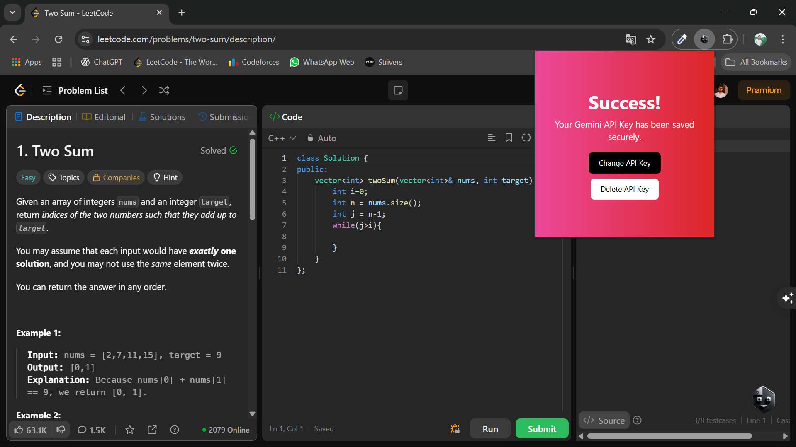
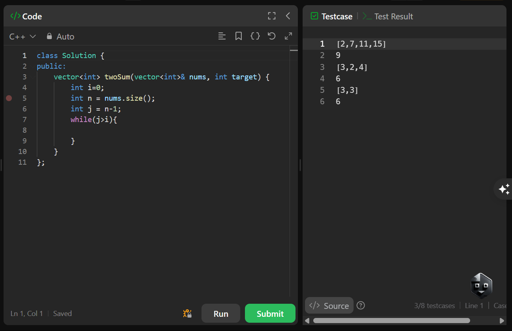
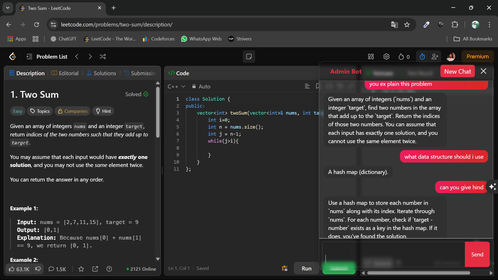

# 💬 AI Chat Chrome Extension

A Chrome extension that adds a floating AI-powered chatbot to any website. Built using **React.js (via Vite)** and powered by the **Gemini API**, this extension allows users to interact with an AI assistant seamlessly while browsing.

---

## 🚀 Features

- 🧠 Ask AI questions from any webpage using a floating chatbot interface
- 🔄 "New Chat" button resets conversation context
- 💾 Stores conversation in `chrome.storage` or `localStorage` for session persistence
- ⚙️ Easily extendable and lightweight

---

## 🛠️ Tech Stack / Tools Used

- **React.js** (via Vite) – Frontend framework
- **JavaScript**
- **Chrome Extensions API (Manifest V3)**
- **Gemini API** – for AI responses
- **Chrome Storage API / localStorage**
- **HTML & CSS**

---

## 📸 Screenshots





> *(Add your own screenshots in a `screenshots/` folder and update links)*

---

---

## 🧪 How to Install (Manually)

1. Clone or download this repository:

```bash
git clone https://github.com/yourusername/ai-chat-extension.git
